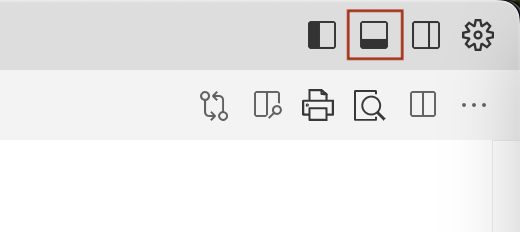

# Prework 1: Setup
## Environment Setup

### 5-Minute Setup Walkthrough for Key Development Tools
In this course, we’ll be using Python. If you’ve never used Python before, don’t worry. We will provide most of the code you'll need. We use Python to provide a common place for all of us to work in during class. We will also be leveraging AI tools to help us develop code, so you don’t need to be expert or even be experienced in Python to get the most out of this course.

Outside of class, if you want to build AI apps using other languages, we will be providing extra code examples in JavaScript and Java for you to use. 

#### Setting Up the Cursor
Cursor is the best AI coding tool currently out there. It will greatly increase the speed at which you develop any application. We will go over how to use Cursor to get the most out of this course and out of your own development workflow.
1. Go to https://www.cursor.com/
2. Click the download button, which will download the install package to your computer. Open the package to install Cursor.
3. Once installed, make sure you can open Cursor. 

#### Setting Up UV
UV is an extremely fast Python package and project manager, written in Rust. We’ll use this to install Python packages we need (including Python itself). 
2. Mac: Run `curl -LsSf https://astral.sh/uv/install.sh | sh` 
   Windows: `powershell -ExecutionPolicy ByPass -c "irm https://astral.sh/uv/install.ps1 | iex"` for Windows

#### Installing Python  
1. uv python install

#### Installing Pip 
Pip is a Python package manager used to install Python libraries.

1. Pip is automatically included with Python. To check if it’s installed, open terminal/command prompt and type:
   ```bash
   pip --version
   ```

#### Setting Up a Python Project

1. Returning to your Cursor window, open a new folder.
2. Open the terminal in Cursor, click on the terminal icon in the top right of the Cursor window.

3. In the terminal, we can create a virtual environment. This environment let's us install packages only for this project. 
 ```bash
 uv venv venv
 ```

3. Now activate the environment:
   - **Windows**:  
     ```bash
     .\venv\Scripts\activate
     ```
   - **Mac/Linux**:  
     ```bash
     source venv/bin/activate
     ```
Note: If you need to deactivate the environment, simply run:
   ```bash
   deactivate
   ```

#### Getting an OpenAI API Key
We will be using the OpenAI API for much of our work. 

1. Visit the [OpenAI API website](https://platform.openai.com/).
2. Sign up or log in.
3. Navigate to the [API section](https://platform.openai.com/api-keys) and generate a new API key (you may need to verify your phone number first). Make sure to copy the key.
4. Create a new environment variable for your OpenAI key. The key is "OPENAI_API_KEY" and the value is the API key you generated.

