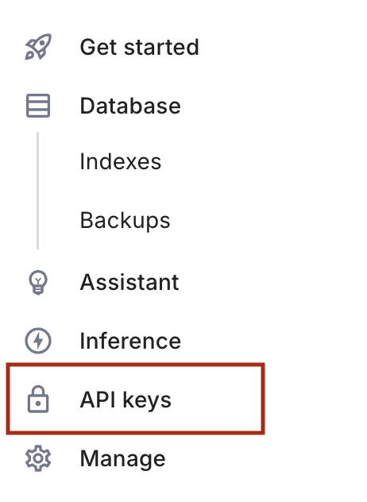
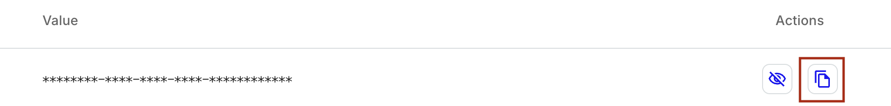

# Setting up a Pinecone Account

Pinecone is a vector database provider that we will use in class. Vector databases allow us to query based on relevency. That means if we have a piece of text, and we want to search a large corpus of text to find similar texts, a vector database can help us do this. We'll get more into how we interact with Pinecone in class, but for now, it's worth setting one up so you can see it working (even if you don't use it for your project).

## Setup Instructions

1. Go to [pincone.io](https://www.pinecone.io/) and click on "Sign Up"

2. Sign up with your proferred provider. You may receive an email with a verifaction code. If you do, open your email and copy the code into Pinecone's page.

3. You'll then answer a few questions about your profile, but when you get to the page that asks "Do you have an embedding model or are you using Pinecone Assistant?", select "I'm have an embedding model". 

4. Once you're done singing up, you will be in your account. You should see the left navigation to the left (it may look different than the picture below). Click on API Keys.

5. You should see one API key in the table that's hidden with asterisks. On the right side of that key is a copy icon. Click the copy icon to copy the key.

6. Save the API key as an environment variable to your machine.

   

   
On Mac:

   - Open your `.bash_profile` file with a text editor: `open ~/.bash_profile`
   - Add the line `export PINECONE_API_KEY={your key}`
   - Save the file and close it

   

   

   
On Windows:

   - Go to "Control Panel" > "System and Security" > "System"
   - Click "Advanced system settings"
   - Select the "Advanced" tab and click "Environment Variables"
   - Under "User variables", click "New"
   - Enter the variable name as "PINECONE_API_KEY" and the value as your key.
   - Click "OK" to save

   

7. With your API Key saved, go back to Pinecone and click on "Database", then click on "Create Index". This will create a database instance you can use for your own project.

    _Note: An index in vector databases is synonomous with a table in traditional databases. You can have many  indexes in your database to store different data._

8. In the "New Index" form, enter an index name of your choice in the top field.

9. In the configuration box, select "Setup by model" button to the right and choose the row with the name "text-embeddings-3-small".

10. Leave all other boxes as is and click on the "Create index" button near the bottom of the screen.

We'll go over in class what embedding models are, how to store things in the database you just created, and how this can benefit our AI projects. For now, you have what you need and can move on.

